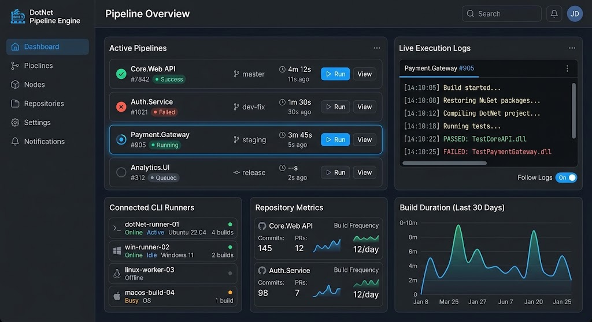

# Plataforma de CI/CD em .NET - Visão Geral do Projeto

Este documento apresenta a arquitetura, visão de produto e estrutura de projetos para a criação de uma plataforma personalizada de CI/CD utilizando **.NET** no backend, **CLI** para interações via terminal e **Angular** para o Dashboard Web.

---

## 1. Visão Geral do Painel de Controle (Projeto Final)



O painel em Angular permitirá monitorar em tempo real as pipelines ativas, visualizar métricas de repositórios, conferir o status dos runners conectados e acompanhar a transmissão ao vivo de logs via WebSockets / SignalR.

---

## 2. Estrutura da Solução e Projetos

A solução será dividida em camadas modulares para facilitar manutenção, escalabilidade e separação de responsabilidades:

```text
MyCiCdEngine/
├── src/
│   ├── Core/
│   │   ├── MyCiCd.Domain/            # Entidades (Pipeline, Job, Step, Build, Runner)
│   │   └── MyCiCd.Application/       # Casos de uso, interfaces, DTOs e orquestração
│   ├── Infrastructure/
│   │   ├── MyCiCd.Infrastructure/    # Banco de dados (EF Core), Docker SDK, Webhooks
│   │   └── MyCiCd.Realtime/          # Hubs do SignalR para streaming de logs
│   ├── Presentation/
│   │   ├── MyCiCd.Api/               # Control Plane (ASP.NET Core Web API)
│   │   └── MyCiCd.Cli/               # CLI em .NET (System.CommandLine / Spectre.Console)
│   └── Workers/
│       └── MyCiCd.Runner/            # Agente executor de builds (Background Service / Worker)
└── web/
    └── my-cicd-ui/                   # Painel de Controle em Angular
```

### Detalhamento dos Componentes:

1. **`MyCiCd.Api` (Control Plane - Web API ASP.NET Core):**
   * Recebe Webhooks do GitHub/GitLab ou chamadas da CLI.
   * Gerencia autenticação, usuários, permissões e segredos/variáveis de ambiente.
   * Expõe endpoints REST para o frontend em Angular e para a CLI.

2. **`MyCiCd.Cli` (Ferramenta CLI em .NET):**
   * Desenvolvida com `Spectre.Console` e `System.CommandLine`.
   * Permite interagir com a plataforma via terminal (`myci login`, `myci pipeline run`, `myci logs`).

3. **`MyCiCd.Runner` (Agente Worker em .NET):**
   * Aplicação `.NET Worker Service` executada na máquina servidora ou remota.
   * Conecta à API para receber tarefas e utiliza a biblioteca `Docker.DotNet` para subir containers efêmeros e capturar a execução de tarefas.

4. **`MyCiCd.Realtime` (SignalR Hub):**
   * Transmite logs de execução do Runner para a API e em tempo real para a CLI e o Dashboard Angular.

5. **`my-cicd-ui` (Painel Angular):**
   * Interface rica usando Angular com RxJS e SignalR Client para reatividade em tempo real.

---

## 3. Arquitetura Técnica e Fluxo de Dados

```
+------------------+         +--------------------+         +-------------------+
|  GitHub/GitLab   |         |    MyCiCd.Cli      |         |  Dashboard Angular|
|  (Webhook Push)  |         | (Comandos do Dev)  |         | (Navegador Web)   |
+--------+---------+         +---------+----------+         +---------+---------+
         |                             |                              |
         | HTTP POST                   | REST API / gRPC              | REST / SignalR
         v                             v                              v
+---------------------------------------------------------------------------------+
|                                 MyCiCd.Api                                      |
|                             (ASP.NET Core API)                                  |
+------------------------------------+--------------------------------------------+
                                     |
                                     | Enfileira Job (Redis / RabbitMQ / Channel)
                                     v
+---------------------------------------------------------------------------------+
|                              MyCiCd.Runner                                      |
|                       (Worker Engine em .NET Core)                              |
+------------------------------------+--------------------------------------------+
                                     |
                                     | Docker.DotNet API
                                     v
+---------------------------------------------------------------------------------+
|                                Containers Docker                                |
|                  (Ex: mcr.microsoft.com/dotnet/sdk:8.0)                        |
|                                                                                 |
| 1. Clone do Repo   -->   2. Build / Testes   -->   3. Publicação/Artefatos     |
+---------------------------------------------------------------------------------+
```

---

## 4. Exemplo de Arquivo de Configuração (`.myci.yaml`)

```yaml
name: .NET Core CI Pipeline
on: [push]

jobs:
  build_and_test:
    image: mcr.microsoft.com/dotnet/sdk:8.0
    steps:
      - name: Restore dependencies
        run: dotnet restore
      - name: Build project
        run: dotnet build --configuration Release --no-restore
      - name: Run unit tests
        run: dotnet test --no-build --verbosity normal
```

---

## 5. Roteiro Sugerido para o MVP

1. **Fase 1 (CLI + Runner Básico):** Criar uma CLI local em C# que leia o arquivo `.myci.yaml`, use `Docker.DotNet` para instanciar containers e exiba o resultado no console.
2. **Fase 2 (Control Plane API + Fila):** Criar a API ASP.NET Core e gerenciar enfileiramento de builds.
3. **Fase 3 (SignalR + Dashboard Angular):** Desenvolver a interface Angular para acompanhamento em tempo real.
